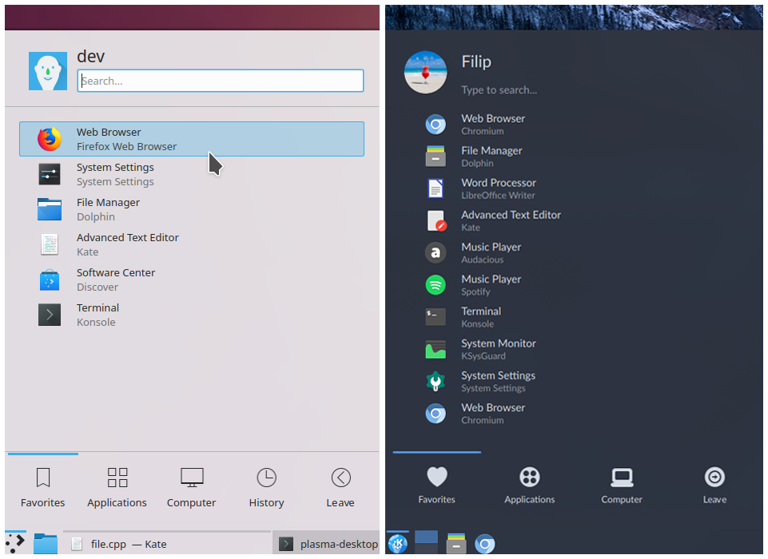

# Unibody Kickoff (Application Launcher)

**PROJECT DESCRIPTION**

This repository contains the version of KDE's Kickoff (Application Launcher) widget without the patches which introduced a permanent search field and separator lines. 

Users may want to use this version of Kickoff if they feel that the search field and separators stick out too much or if they simply prefer the old look. 

The goal of the project is to keep providing backported fixes to Kickoff, all the while retaining its unibody look.

I've also added two fixes of my own: fixed kerning in tab labels and fixed vertical aligment of the Type to search... text.

**Comparison between Kickoff and Unibody Kickoff:**

**INSTALLATION INFO**

1) KDE Store

- The KDE Store package can be found here: https://www.opendesktop.org/p/1274927/

2) Direct copy

You can also just download the ZIP of this repo. The next step would be to unpack the ZIP. Then create a folder called org.kde.plasma.unibodykickoff. Now put the contents of the ZIP's package folder inside it - this means that your new folder consists of a contents folder and a metadata.desktop file. You then have to copy the newly created org.kde.plasma.unibodykickoff folder to:

a) if you want per-user availability: /home/.local/share/plasma/plasmoids

b) if you want it to be available for all users: /usr/share/plasma/plasmoids
