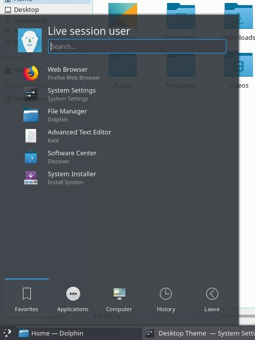
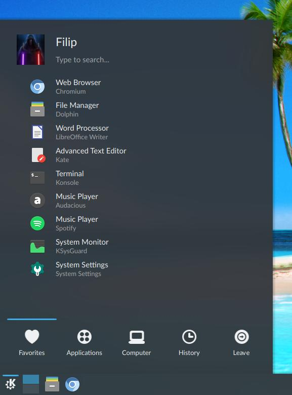

# Fieldless Kickoff (Application Launcher)

PROJECT DESCRIPTION

This repository contains the version of KDE's Kickoff (Application Launcher) widget without the patch which introduces a permanent search field.

The patch is set to appear in Plasma 5.15 and it is thus so far only present in KDE Neon Unstable Developer Edition.

The reason for this project's existence is that the author does not believe the current implementation of the search field to be satisfactory enough. Namely, the field can stick out too much, especially when using very transparent themes.

The intention of the project is to keep providing backported fixes to Kickoff, all the while retaining its fieldless look. Should the search field issues be addressed properly in whichever way, this widget will remain as a "classic" alternative.

Comparison between Kickoff and Kickoff (Fieldless):

 

INSTALLATION INFO

1) KDE Store

- The KDE Store package can be installed by

2) Direct copy

a) per-user: copy to 
b) globally: copy to 

KNOWN INHERITED BUGS
- When you click on "Type to search..." you cannot use the Esc key to turn off the search field; you have to actually type something for the Esc key to work. 
